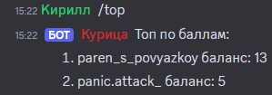
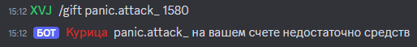
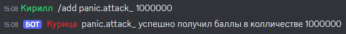
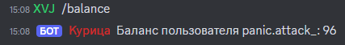
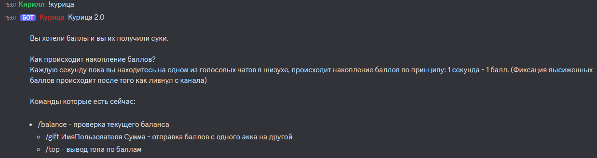

# Курица BOT
Бот с подсчетом баллов в зависимости от времени проведенного в голосовом канале.
## Функцинальность
| Команды                                         | Ответы                                 |
|-------------------------------------------------|----------------------------------------|
| /top                                            |          |
| /gift ИмяПользователя Кол-во баллов             |        |
| /add ИмяПользователя Кол-во баллов (для админа) |          |
| /balance                                        |  |
| !курица                                         |    |
## Содержание
- [Функцинальность](#Функцинальность)
- [Технологии](#технологии)
- [Разработка](#разработка)

## Технологии
- [Java 17](https://www.java.com/ru/)
- [Discord4J](https://discord4j.com/)
- [Spring](https://spring.io/)
- [Hibernate](https://hibernate.org/)
- [Maven](https://maven.apache.org/)

## Использование
1. В Application.properties вставьте свой токен, полученный на [Dev портале Discord](https://discord.com/developers/applications)
2. Выдайте боту роль админа.
3. Склонируйте к себе репозиторий.
```sh
$ git clone https://github.com/parnysha/discordPointsBot.git 
```
4. Упакуйте свой проект при помощи Maven.
```sh
$ mvn clean package
```
5. Соберите Docker-image.
```sh
$ docker build -t discord-points-bot:0.0.1 .
```
6. Запустите Docker-container.
```sh
$ docker run -d -p 8080:8080 -t discord-points-bot:0.0.1
```
7. Проверьте работоспособность бота на сервере.
